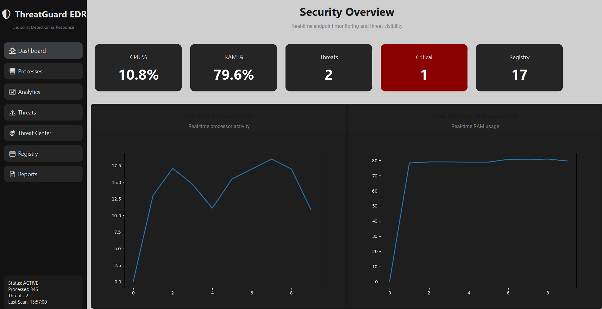
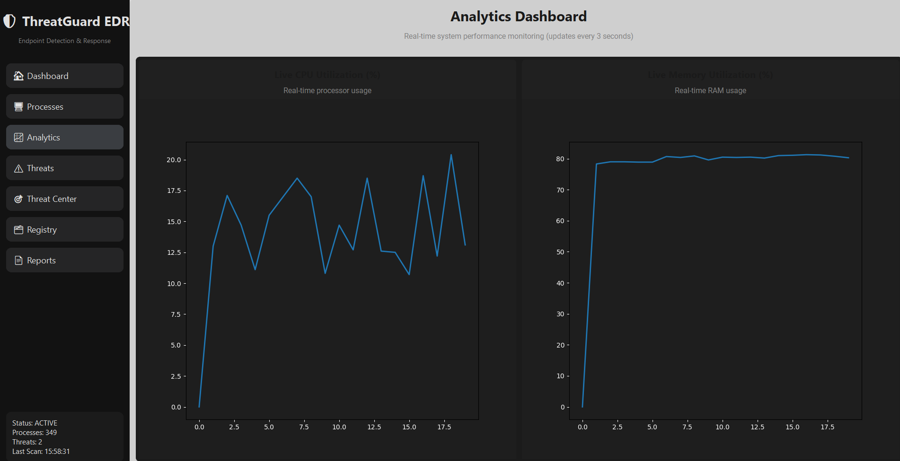
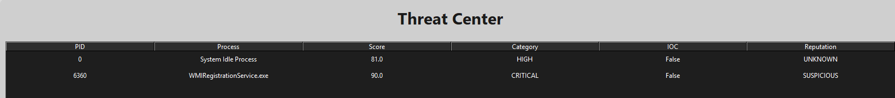
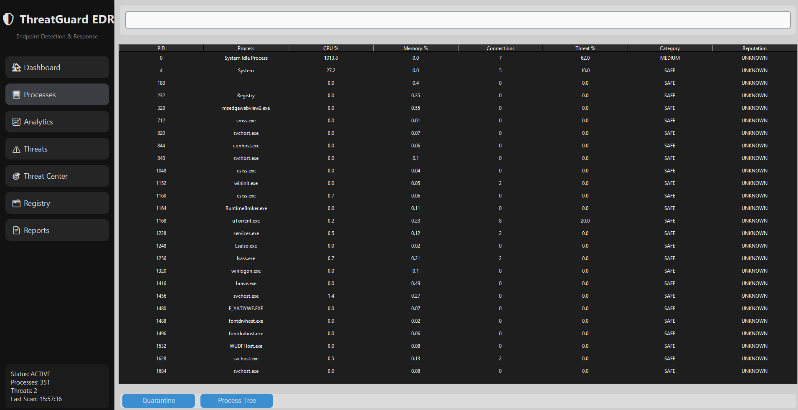

# ThreatGuard EDR

ThreatGuard EDR is a Python-based Endpoint Detection and Response (EDR) platform designed to monitor processes, detect suspicious activity, analyze threats, and provide real-time security visibility through a modern desktop dashboard.

## Features

- Process Monitoring
- Network Activity Monitoring
- Registry Monitoring
- IOC (Indicator of Compromise) Detection
- SHA256 Hash Analysis
- Reputation Engine
- Behavioral Threat Detection
- Threat Scoring System
- Threat Center Dashboard
- Automated Quarantine
- Incident Logging
- PDF Report Generation
- Real-Time Analytics Dashboard

## Technology Stack

- Python 3.12
- CustomTkinter
- Psutil
- Matplotlib
- ReportLab

## Project Structure

```text
src/
├── gui/
├── monitors/
├── threat_engine/
├── threat_intelligence/
├── incidents/
├── response/
└── utils/
```

## Installation

```bash
git clone https://github.com/Mohan-10-15/ThreatGuard-EDR.git

cd ThreatGuard-EDR

pip install -r requirements.txt

python main.py
```


## Screenshots

### Dashboard



### Analytics



### Threat Center



### Process Monitor


## Features Overview

### Detection Capabilities

- AI-Based Threat Scoring
- IOC Detection
- Behavioral Analysis
- Reputation Analysis
- SHA256 Hashing
- Registry Monitoring
- Network Connection Monitoring

### Response Capabilities

- Process Quarantine
- Incident Logging
- Threat Center
- PDF Report Generation

## Author

Mohanakrishnan C

Cybersecurity & Python Development Project